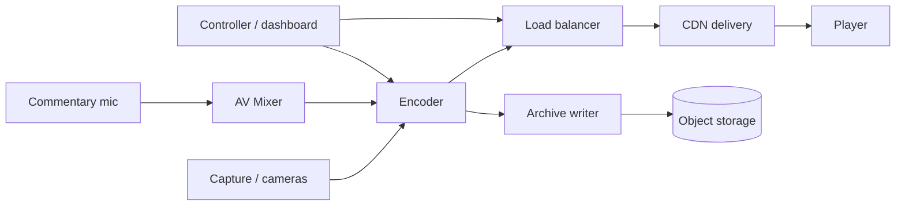

# Sports Event Streaming Platform - Lab 1

Domain: live sports event streaming (multi-camera video, audio, telemetry).

This repository describes the system context, requirements, architecture
views, architecture decision records (ADRs) and quality scenarios, following
ISO/IEC/IEEE 42010.

## How to view the diagrams
Open the .svg files in docs/diagrams/ in any web browser:
context.svg, components.svg, deployment.svg.
The .mmd sources are the editable Mermaid sources.

## Contents
- docs/requirements.md - context, stakeholders, data register, FRs, NFRs
- docs/quality-scenarios.md - two quality attribute scenarios
- docs/adr/ - three architecture decision records
## Architecture Diagrams
### 1.components

### 2.context
```mermaid
graph TB
  broadcaster[Event broadcaster] --> SYS((Sports Streaming Platform))
  viewer[Remote viewer] --> SYS
  admin[Platform admin] --> SYS
  club[Club media portal] --> SYS
  SYS --> LMS[Media archive / portal]
  ```

  ### 3.deployment
  ```mermaid
graph TB
  subgraph Edge[Edge node at venue]
    C1[Cam capture]
    E1[Encoder]
    M1[Mixer]
  end
  subgraph Cloud[Cloud region]
    LBn[Load balancer]
    CDNn[CDN edge]
    ST[(Object storage)]
    DASH[Dashboard]
  end
  C1 --> M1 --> E1 --> LBn --> CDNn
  E1 --> ST
  DASH --> E1
  CLIENT[Viewer device] --> CDNn
   ```