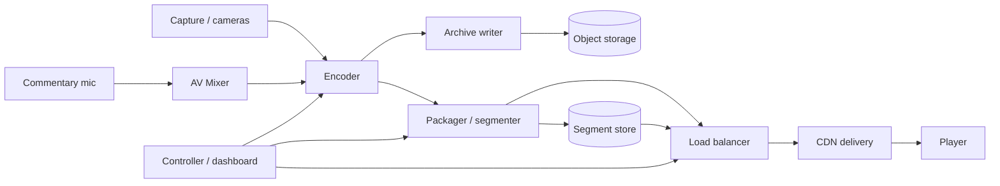
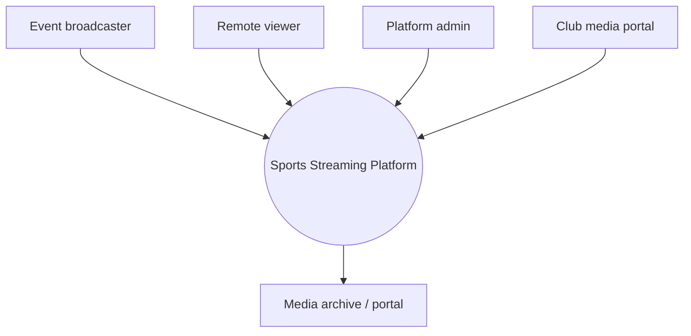
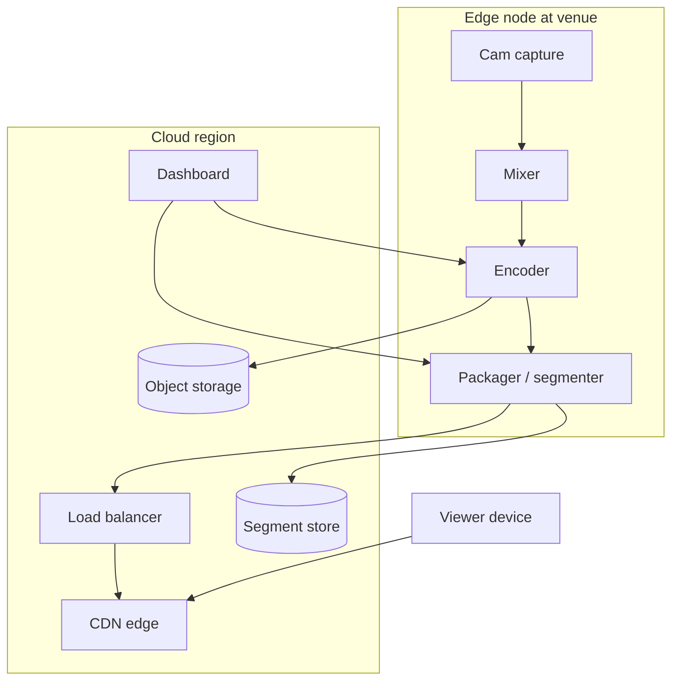

# Sports Event Streaming Platform: Labs 1 and 2

Domain: live sports event streaming (multi-camera video, audio, telemetry).

Course project for *Architectures of Multimedia and Smart Systems*. Lab 1 covers the system context, requirements, architecture views, architecture decision records and quality scenarios, following ISO/IEC/IEEE 42010. Lab 2 adds the media processing pipeline, the quality ladder for adaptive streaming and the measurements behind the quality of experience.

## How to view the diagrams

Open the `.svg` files in `docs/diagrams/` in a browser: `context.svg`, `components.svg`, `deployment.svg`. The `.mmd` files next to them are the sources, and each SVG is rendered from its source with:

```bash
npx @mermaid-js/mermaid-cli -i docs/diagrams/components.mmd \
    -o docs/diagrams/components.svg -t dark -b '#020817'
```

## Contents

- `docs/requirements.md`: context, stakeholders, data register, FRs, NFRs
- `docs/quality-scenarios.md`: two quality attribute scenarios
- `docs/adr/`: four records, 0001 to 0003 from Lab 1 and 0004 from Lab 2
- `docs/pipeline.md`: Lab 2 session 1, source material, pipeline, H.264 against AV1
- `docs/qoe.md`: Lab 2 session 2, ladder, network profiles, QoE, link to the architecture
- `pipeline/pipeline.py`: decoding, transformation, encoding, measurement
- `stream/package.sh`, `stream/player.html`: ladder, packaging, QoE instrumentation
- `results/encoding.csv`, `results/qoe.csv`: the measurements
- `tools/qoe_measure.mjs`: QoE runs in Chrome over the DevTools protocol

## Lab 2, how to reproduce

FFmpeg 6 or newer with `libx264` and `libsvtav1`, Python 3 with OpenCV, Node.js 18 or newer, Chrome.

```bash
# 0. environment
python3 -m venv .venv && source .venv/bin/activate    # Windows: .venv/Scripts/activate
pip install -r pipeline/requirements.txt

# 1. source material: data/raw.mov at 1920x1080, 30 fps, 60 s, no audio
#    Not committed. The exact ffmpeg command is in docs/pipeline.md.

# 2. session 1: reference, four variants, results/encoding.csv  (~3.5 min)
python pipeline/pipeline.py

# 3. session 2: ladder and 2 s HLS segments  (~1 min)
./stream/package.sh

# 4. serve the stream, with stream/ as the site root
python -m http.server 8000 --directory stream

# 5. manual QoE at http://localhost:8000/player.html
#    F12, Network, Disable cache, Throttling, then add the profiles of docs/qoe.md

# 6. automated QoE: three profiles, two runs each
cd tools && npm install && cd ..
node tools/qoe_measure.mjs --repeats 2 --out results/qoe.csv
```

The experiments quoted in `docs/qoe.md`:

```bash
BOTTOM=1 ./stream/package.sh                       # four-rung ladder into stream/hls4/
node tools/qoe_measure.mjs --profiles P3:700:400 --src hls4/master.m3u8 --repeats 2
node tools/qoe_measure.mjs --profiles P3:700:400 --startlevel 0 --repeats 2
node tools/qoe_measure.mjs --profiles P1:8000:40 --drop-after 12 --drop-to P3
```

## Results

| | |
|---|---|
| Uncompressed rate by formula (1) | 1.49 Gbit/s (1920×1080, 30 fps, 24 bit) |
| H.264 at 1080p30, 2500 and 5000 kbit/s | PSNR 40.13 and 43.30 dB, SSIM 0.9677 and 0.9815 |
| AV1 at 1080p30, 2500 and 5000 kbit/s | PSNR 41.96 and 43.93 dB, SSIM 0.9727 and 0.9797 |
| AV1 saving at equal quality | 27 % by SSIM, 37 % by PSNR |
| Ladder | 1080p at 3000, 720p at 1330, 480p at 590 kbit/s, constant 0.048 bit/pixel |
| Stall ratio on the worst profile | 0.088 with three rungs, 0.022 with the fourth |
| Startup on the worst profile | 9.2 s with the manifest default, 2.5 s with `startLevel: 0` |

`data/` and the HLS segments stay out of Git. The manifests, the scripts and the measurement tables are committed.

## Media licence

`data/raw.mov` comes from *Durango Rugby Taldea jugando vídeo.ogv* by Txo, Wikimedia Commons, CC BY-SA 4.0. `docs/pipeline.md` has the attribution and the normalisation command.

## Architecture diagrams

### 1. Components


```mermaid
graph LR
  CAP[Capture / cameras] --> ENC[Encoder]
  MIC[Commentary mic] --> MIX[AV Mixer]
  MIX --> ENC
  ENC --> PKG[Packager / segmenter]
  PKG --> LB[Load balancer]
  LB --> CDN[CDN delivery]
  CDN --> PLAY[Player]
  ENC --> ARCH[Archive writer]
  ARCH --> OBJ[(Object storage)]
  PKG --> SEG[(Segment store)]
  SEG --> LB
  CTRL[Controller / dashboard] --> ENC
  CTRL --> PKG
  CTRL --> LB
```

### 2. Context


```mermaid
graph TB
  broadcaster[Event broadcaster] --> SYS((Sports Streaming Platform))
  viewer[Remote viewer] --> SYS
  admin[Platform admin] --> SYS
  club[Club media portal] --> SYS
  SYS --> LMS[Media archive / portal]
```

### 3. Deployment


```mermaid
graph TB
  subgraph Edge[Edge node at venue]
    C1[Cam capture]
    E1[Encoder]
    M1[Mixer]
    P1[Packager / segmenter]
  end
  subgraph Cloud[Cloud region]
    LBn[Load balancer]
    CDNn[CDN edge]
    ST[(Object storage)]
    SEGn[(Segment store)]
    DASH[Dashboard]
  end
  C1 --> M1 --> E1 --> P1 --> LBn --> CDNn
  P1 --> SEGn
  E1 --> ST
  DASH --> E1
  DASH --> P1
  CLIENT[Viewer device] --> CDNn
```
